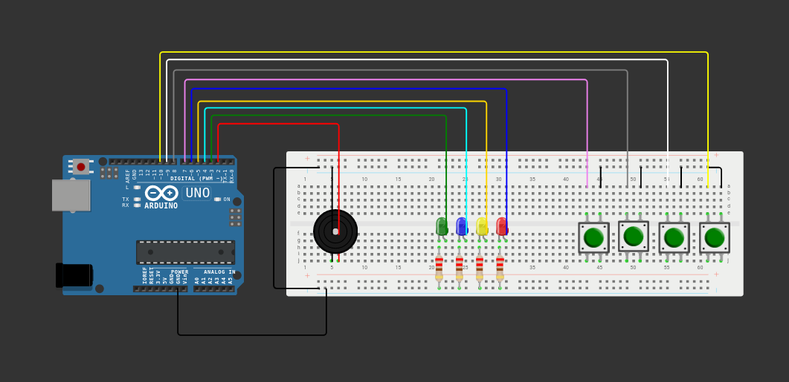

# simon-game
Simple simon game written in C++ using the Arduino framework and PlatformIO for the ATmega328P. The tones used were inspired on the 2014 version of Simon called [Simon Swipe](https://en.wikipedia.org/wiki/Simon_(game)#Gameplay).

[Wokwi](https://wokwi.com/projects/352345922306355201) can be accessed for a simulation of the game.

## Hardware Implementation

### List of Components
| Component      | Quantity    |
| -----------    | ----------- |
| Push-button    | 4           |
| Green LED      | 1           |
| Blue LED       | 1           |
| Yellow LED     | 1           |
| Red LED        | 1           |
| Passive Buzzer | 1           |
| 220 Ω Resistor | 4           |
| Breadboard     | 1           |
| Arduino Uno    | 1           | 
